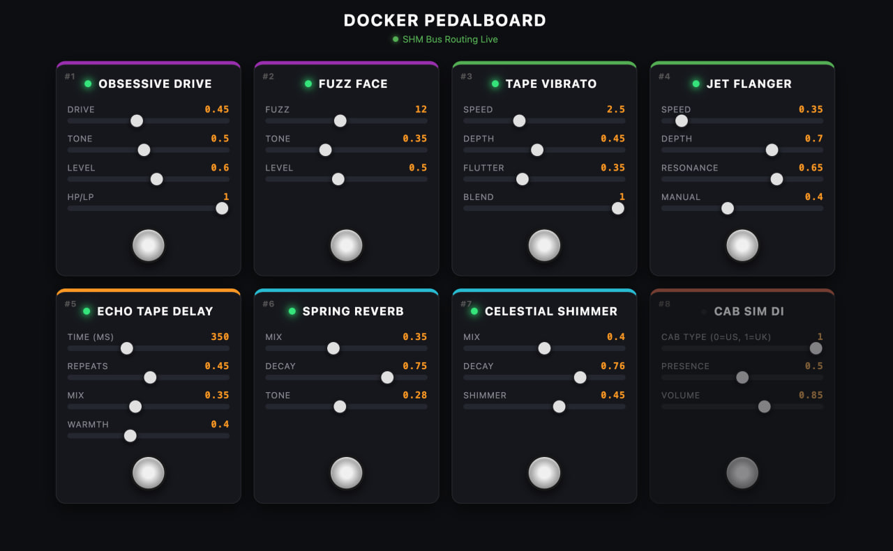
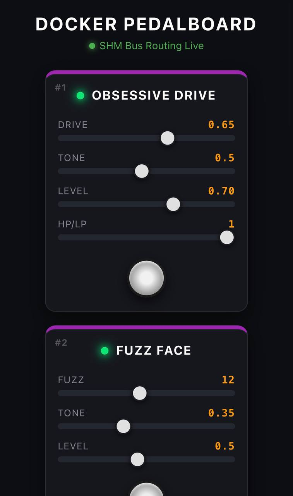

# Docker Pedalboard 🎸🐳

A modular, real-time digital guitar multi-effects processor running entirely inside Docker containers on Linux. Tested on an Orange Pi Zero 3 (arm64).

Each audio effect runs as an **isolated microservice**. Audio blocks are passed between plugins through **POSIX shared memory (`/dev/shm`) and semaphores**, while parameters and drag-and-drop pedal reordering are controlled over UDP from a web dashboard.

<p>
  
  
</p>
---

## ⚡ Key Highlights

- **Low-latency shared-memory audio bus:** inter-container audio streaming via mapped shared memory (`/dev/shm/pedal_bus`), synchronized with POSIX semaphores.
- **Dynamic reordering:** rearrange the pedal order from the web interface in real time, without restarting containers.
- **Microservice architecture:** every pedal is a standalone container with its own C++17 DSP implementation. Add or replace pedals without rebuilding the whole system.
- **Multi-arch images:** Docker Hub images are built for both `linux/arm64` and `linux/amd64`.
- **Web UI:** responsive control interface for desktop and mobile browsers.

### Latency

The engine runs at 48 kHz with a 256-sample period, which is ≈ 5.3 ms per audio buffer. Each plugin in the chain hands its block to the next one through shared memory, so total latency depends on the number of active pedals and on the audio interface.

<!-- TODO: add your measured round-trip latency, e.g. "Measured round trip on Orange Pi Zero 3 with all 8 pedals: X ms" -->

---

## 🎛️ Included Effects Chain

| Order | Pedal Name | Category | Controls | On at startup |
|---|---|---|---|---|
| **#1** | **Obsessive Drive** | Distortion / Overdrive | Drive, Tone, Level, HP/LP mode | ✅ |
| **#2** | **Fuzz Face** | Vintage Fuzz | Fuzz, Tone, Level | |
| **#3** | **Jet Flanger** | Modulation | Speed, Depth, Resonance, Manual | |
| **#4** | **Tape Vibrato** | Modulation / Chorus | Speed, Depth, Flutter, Blend | |
| **#5** | **Echo Tape Delay** | Time / Delay | Time (ms), Repeats, Mix, Warmth | |
| **#6** | **Spring Reverb** | Reverb | Mix, Decay, Tone | ✅ |
| **#7** | **Celestial Shimmer** | Pitch / Reverb | Mix, Decay, Shimmer Pitch | |
| **#8** | **Cab Sim DI Box** | Cabinet Simulator | Cab Type (US/UK), Presence, Volume | ✅ |

---

## ✅ Tested Platforms

| Platform | Architecture | Status |
|---|---|---|
| Orange Pi Zero 3 | arm64 | Tested |
| Desktop Linux (x86_64) | amd64 | Image built, not tested |
| Raspberry Pi | arm64 | Image built, not tested |

Multi-arch images are published, but only the Orange Pi Zero 3 has been verified on real hardware. Reports from other systems are welcome.

---

## 🚀 Quick Start (Pre-built Images)

### Prerequisites

- A Linux host (Ubuntu, Debian, Armbian, etc.)
- Docker and Docker Compose installed
- A class-compliant USB audio interface or sound card

### 1. Download `docker-compose.yml`

```bash
mkdir docker-pedalboard && cd docker-pedalboard
curl -O https://raw.githubusercontent.com/ksteeen/docker-pedalboard/main/docker-compose.yml
```

### 2. Identify your audio device

List the available capture cards:

```bash
arecord -l
```

The default device is `hw:Go,0`. If yours is different, set the `AUDIO_DEVICE` environment variable. The easiest way is a `.env` file next to `docker-compose.yml`:

```bash
echo 'AUDIO_DEVICE=hw:CARD,0' > .env
```

Replace `CARD` with the card name or number shown by `arecord -l`.

### 3. Launch

```bash
docker compose up -d
```

Open `http://<YOUR_DEVICE_IP>` in your browser to access the control panel.

### Choosing which pedals start enabled

Every pedal has an `<NAME>_ACTIVE` variable that sets its initial state (`1` = on, `0` = off). By default Obsessive Drive, Spring Reverb and Cab Sim start enabled. For example:

```bash
FUZZ_ACTIVE=1 DELAY_ACTIVE=1 docker compose up -d
```

Available variables: `OVERDRIVE_ACTIVE`, `FUZZ_ACTIVE`, `FLANGER_ACTIVE`, `VIBRATO_ACTIVE`, `DELAY_ACTIVE`, `REVERB_ACTIVE`, `SHIMMER_ACTIVE`, `CABSIM_ACTIVE`.

---

## 🛠️ Building from Source

If you want to modify the DSP algorithms or build your own plugins:

```bash
git clone https://github.com/ksteeen/docker-pedalboard.git
cd docker-pedalboard
docker compose -f docker-compose.build.yml up -d --build
```

---

## 📐 Architecture

```text
                 +--------------------------------------+
                 |      Web Dashboard (FastAPI / JS)    |
                 +-------------------+------------------+
                                     | UDP commands
                                     v
+-------------+      +--------------------------------------+      +-------------+
| ALSA Input  | ---> | Slot 0 -> Slot 1 -> ... -> Slot 8    | ---> | ALSA Output |
| (Guitar In) |      |        Shared Memory (/dev/shm)      |      | (Out / Cabs)|
+-------------+      +--------------------------------------+      +-------------+
                                     ^
                     Synchronized via POSIX semaphores
```

- **`engine`**: manages the ALSA capture and playback streams (48 kHz, 256-sample period) and creates the `/pedal_bus` shared memory segment.
- **`plugins/*`**: each plugin reads its input slot from shared memory, processes the block with custom C++17 DSP, and posts the result to the next slot.
- **`dashboard`**: inspects running pedal containers through the Docker socket, renders the controls, and sends parameter changes as UDP datagrams.

### Slots and ports

The bus has one more slot than there are pedals. **Slot 0** holds the raw input written by the engine. Each pedal reads slot *N* and writes slot *N+1*, so the processed signal ends up in **slot 8**, which the engine sends to the ALSA output. Reordering pedals changes which slots they read from and write to.

Default layout:

| Pedal | Input slot | Output slot | UDP port |
|---|---|---|---|
| Obsessive Drive | 0 | 1 | 9003 |
| Fuzz Face | 1 | 2 | 9000 |
| Jet Flanger | 2 | 3 | 9007 |
| Tape Vibrato | 3 | 4 | 9004 |
| Echo Tape Delay | 4 | 5 | 9005 |
| Spring Reverb | 5 | 6 | 9001 |
| Celestial Shimmer | 6 | 7 | 9002 |
| Cab Sim DI Box | 7 | 8 | 9008 |

---

## 🐳 Docker Requirements

The provided compose files already set this up. If you write your own, keep in mind:

- **Sound device (engine):** pass `/dev/snd` into the container with `devices: ["/dev/snd:/dev/snd"]`.
- **Shared memory (engine and every plugin):** bind-mount the host's `/dev/shm` with `volumes: ["/dev/shm:/dev/shm"]`, so all containers see the same `pedal_bus` segment.
- **Docker socket (dashboard only):** mounted so the dashboard can discover running pedals. See the security note below.
- **Network:** all services share the `pedal_net` bridge network, which carries the UDP control traffic.

---

## 🔒 Security Note

The dashboard mounts the Docker socket (`/var/run/docker.sock`). Even with the `:ro` flag, which only makes the socket file read-only, anything that can reach the dashboard can effectively talk to the Docker API, which is **equivalent to root access on the host**. The web UI has no authentication. Run it only on a trusted local network and **do not expose port 80 to the internet**. For remote access, use a VPN or an authenticated reverse proxy.

---

## 🧩 Writing Your Own Plugin

A plugin is a separate container with a C++17 DSP implementation. Each plugin is started with three positional arguments:

```text
<input_slot> <output_slot> <udp_port>
```

and reads its initial on/off state from the `PEDAL_ACTIVE` environment variable. At a high level it must:

1. Attach to the `/pedal_bus` shared memory segment.
2. Wait on the semaphore for its input slot.
3. Process one audio block.
4. Write the result to its output slot and post that slot's semaphore.
5. Listen for parameter updates on its UDP port.

To add a pedal, create `plugins/<name>/Dockerfile`, then add a service to `docker-compose.build.yml`. The example below appends a ninth pedal after the Cab Sim, which also means raising the engine's final slot argument from `8` to `9`:

```yaml
  myeffect:
    build:
      context: .
      dockerfile: plugins/myeffect/Dockerfile
    environment:
      - PEDAL_ACTIVE=${MYEFFECT_ACTIVE:-0}
    volumes:
      - /dev/shm:/dev/shm
    command: ["8", "9", "9009"]
    networks:
      - pedal_net
    restart: always
```

<!-- TODO: link an existing plugin (e.g. plugins/overdrive) as a reference implementation, or add a minimal skeleton .cpp here. -->

---

## 🩺 Troubleshooting

**No sound**
- Check the device name with `arecord -l` and `aplay -l`, and make sure `AUDIO_DEVICE` (in your environment or `.env` file) matches it.
- Confirm the engine container can see `/dev/snd` (`docker compose exec engine ls /dev/snd`).
- Make sure the engine and the plugins all mount the host's `/dev/shm`.
- Check that the pedals you expect are enabled in the dashboard.

**Crackling, dropouts or xruns**
- Reduce the number of active pedals or the load on the host.
- Make sure nothing else is using the audio device.
- Check CPU load with `top`; on small boards the heavier effects (reverb, shimmer) cost the most.

**A pedal does not show up in the dashboard**
- Check that its container is running (`docker compose ps`).
- Check that the dashboard has access to the Docker socket.

**The dashboard does not open**
- Verify the device IP and that nothing else is using port 80.

---

## 📜 License

MIT License. Feel free to fork, add plugins, and build your own hardware pedalboards!
